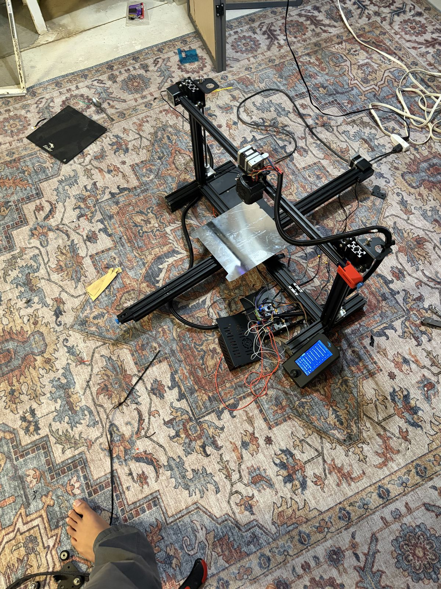
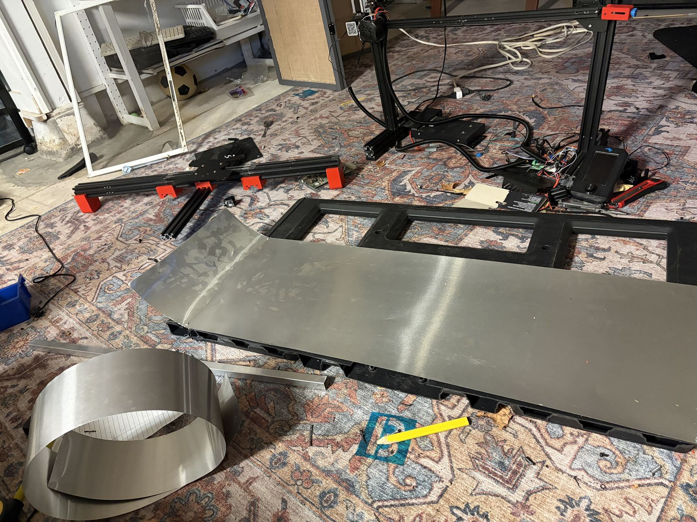
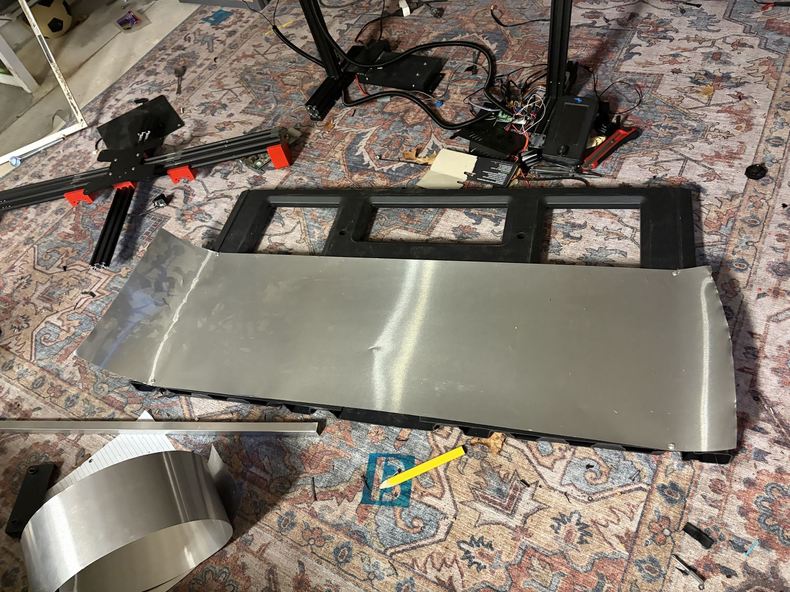
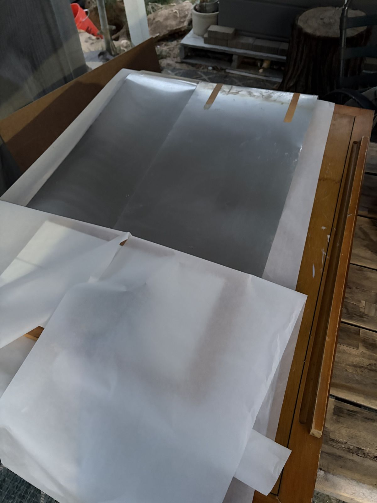

# Build Journal — Ender3-2

## June 18: Dismantling and Frame Drilling

I started by completely dismantling both printers. Then I used a bolt cutter to create a double-sided screw and used that to join together 3 pieces of 4040 taken from the base of the printers. Then I drilled new mounting holes in this long 4040 piece and assembled the Y-axis.

*Drilling center holes*

**Time spent this session: 9 hours**

---

## June 19: Frame Assembly

Y-axis next to normal-sized print bed.

Originally, I only wanted to extend the y-axis, but then I realized It's go big or go home, so I decided to also extend the x-axis with the same double-sided screw trick. And I figured it would be a waste if I didn't also use two lead screws since I had them. Those were wired in parallel.

**Time spent this session: 8 hours**

---

## June 20: First Power-On and Electronics

Here you can see the v1:

**Time spent this session: 8 hours**

---

## June 22–23: More Assembly

**Time spent this session: 10 hours**

---

## July 1-9: The Bed

Now came the actual hard part: making a bed that big. Originally my idea was to take a basketball backboard and put some aluminum over it, but that was nowhere near level enough or stable enough to actually be used. I tried reinforcing it with epoxy and a couple other ideas, but none of them really worked well enough.
So I ended up ditching it for a piece of plywood reinforced with some scrap metal I found on the side of the road. The compromise with this is that it's prone to warping, is heavier, and also can't be heated. I tried several alternatives during this time, but this was the cheapest option I could find.

I also added some supports on either end of the y-axis to help it not tilt. And some pieces on the boundary between the 4040s to lock it in place.

It was during this time that I also added a second motor on the y-axis to help it move such a large bed, wiring them in series to regulate current. This took so much longer than I would have thought, as the Ender 3 uses its own special wiring, so I was following the wrong diagrams for several hours.

**Time spent this session: 14 hours**

---

## July 10–11: Firmware

Now came another very difficult step: writing custom firmware. This took me forever to get the bed leveling working, as first off, 12x18 is a non-square probe arrangement and is bordering on the limits of the controller, and second, there were a lot of hidden things inside of the firmware that override the settings I put. I also have it probe the board concentricity, as that lets you catch errors early, as probing takes quite a while at this scale. But I finally figured it out. It uses a **12×18 probe point arrangement**.

📹 [Building the frame](videos/IMG_0404.MOV)

Here you can see the very first test print I did.

📹 [First test print](videos/IMG_0472.MOV)

Between the clearance holes cut for screws and the gaps between the pieces of 4040, the y-axis is rather bumpy, and every time it crosses over a gap, it jumps a little, leading to some pretty bad artifacts on the prints. But I'm going to try to remedy those at a later time with some JB Weld.

📹 [Printing](videos/IMG_0479.MOV)

📹 [More printing](videos/IMG_0481.MOV)

📹 [Final result](videos/IMG_0483.MOV)

**Final build volume: 585mm (X) × 775mm (Y) × 230mm (Z)**

The Z-axis got cut down because the bed is thicker than the original.

**Time spent this session: 15 hours**
